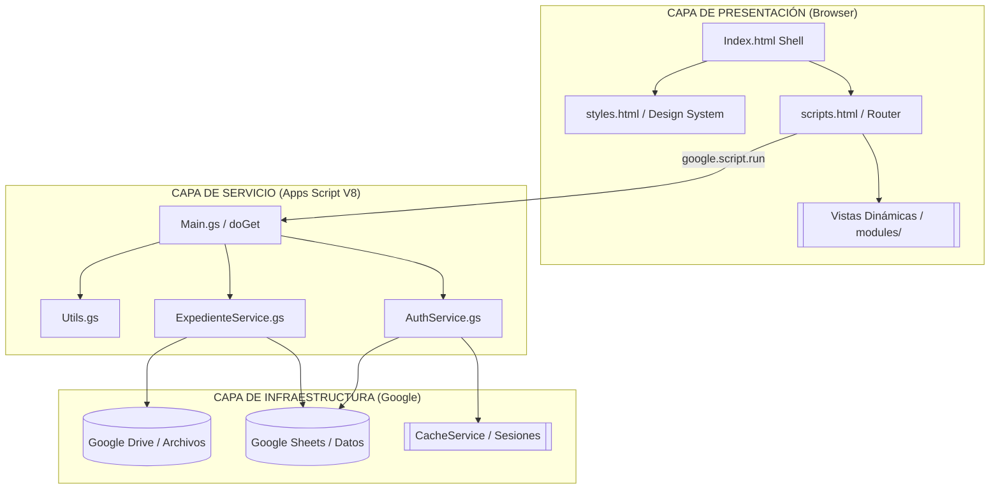
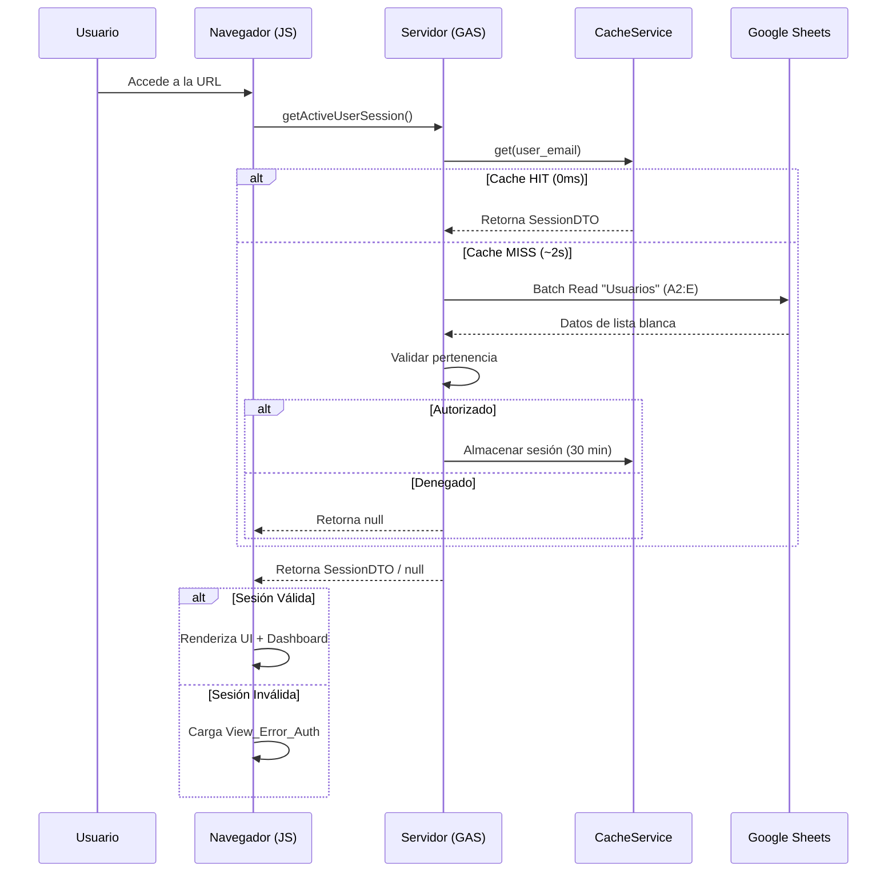
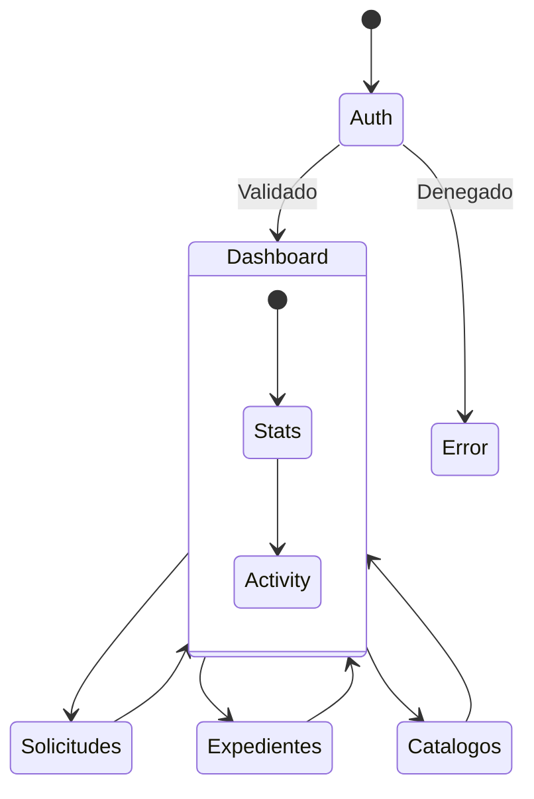

<div align="center">

# ◈ Sistema de Compras HCG

### División de Servicios Administrativos · Hospital Civil de Guadalajara

<br>


<br>

> **Plataforma web institucional** para la gestión integral de compras, requisiciones, expedientes digitales y catálogos del Hospital Civil de Guadalajara.

<br>

---

</div>

## ◎ Tabla de Contenidos

<table>
<tr>
<td width="50%" valign="top">

### 📋 General
- [▸ Descripción del Proyecto](#-descripción-del-proyecto)
- [▸ Características Principales](#-características-principales)
- [▸ Arquitectura del Sistema](#-arquitectura-del-sistema)
- [▸ Flujo de Autenticación](#-flujo-de-autenticación)
- [▸ Estructura de Archivos](#-estructura-de-archivos)
- [▸ Stack Tecnológico](#-stack-tecnológico)

</td>
<td width="50%" valign="top">

### ⚙️ Desarrollo
- [▸ Configuración del Entorno](#-configuración-del-entorno)
- [▸ Despliegue](#-despliegue)
- [▸ Módulos del Sistema](#-módulos-del-sistema)
- [▸ Sistema de Caché](#-sistema-de-caché)
- [▸ Design System](#-design-system)
- [▸ Guía de Estilo](#-guía-de-estilo-del-código)
- [▸ Optimización](#-rendimiento-y-optimización)

</td>
</tr>
</table>

---

## ◎ Descripción del Proyecto

**Sistema de Compras HCG** es una aplicación web monolítica construida sobre **Google Apps Script** que opera como una **SPA (Single Page Application)** dentro del ecosistema de Google Workspace. Diseñada para la **División de Servicios Administrativos**, centraliza los flujos de trabajo de adquisiciones institucionales con un enfoque en rendimiento y seguridad.

### ✨ Características Principales

|  #  | Característica                     | Descripción                                                                      |
| :--- | :--------------------------------- | :------------------------------------------------------------------------------- |
|  1  | **🔐 Autenticación institucional** | Validación contra lista blanca en Google Sheets con CacheService (TTL 30 min).   |
|  2  | **⚡ SPA con carga dinámica**      | Navegación fluida sin recarga de página mediante renderizado parcial de vistas.   |
|  3  | **🎨 UI de Alto Nivel**            | Diseño con Glassmorphism, animaciones escalonadas y tipografía premium.          |
|  4  | **📦 Arquitectura Modular**        | Separación estricta entre Servicios (.gs), Controladores y Vistas (.html).       |
|  5  | **🚀 Optimización Extrema**        | Batch reads, búsquedas en memoria y minimización de llamadas a la API de Google. |
|  6  | **♿ Accesibilidad Pro**           | Roles ARIA, focus-visible y cumplimiento de contraste WCAG.                      |

---

## ◎ Arquitectura del Sistema

El sistema utiliza una arquitectura desacoplada donde el servidor (GAS) actúa como una API interna para el cliente (Browser).



---

## ◎ Flujo de Autenticación

Un proceso robusto que garantiza la seguridad institucional mediante el uso eficiente de caché.



---

## ◎ Estructura de Archivos

```text
📦 compras-fr
│
├── 📄 package.json                     # Configuración de herramientas de desarrollo
├── 📄 .claspignore                     # Archivos excluidos del despliegue
│
└── 📂 src/                             # Código fuente (Desplegado a GAS)
    │
    ├── 📄 appsscript.json              # Manifiesto (V8 Runtime, Timezone)
    ├── 📄 Config.gs                    # Configuración global (IDs, Enums, TTL)
    ├── 📄 Main.gs                      # Punto de entrada HTTP y Router Server-side
    ├── 📄 Utils.gs                     # Funciones de ayuda y formateo
    │
    ├── 📂 Services/                    # Capa de Lógica de Negocio
    │   ├── 📄 AuthService.gs           # Seguridad, Sesiones y Caché
    │   └── 📄 ExpedienteService.gs     # Gestión de documentos y folios
    │
    └── 📂 ui/                          # Capa de Interfaz de Usuario
        ├── 📄 Index.html               # Contenedor base de la SPA
        ├── 📄 scripts.html             # Lógica del cliente (SPA Router, Events)
        ├── 📄 styles.html              # Design System (Tokens, CSS Grid, Utility)
        │
        └── 📂 modules/                 # Módulos Funcionales (Vistas)
            ├── 📄 View_Dashboard.html  # Panel de control y estadísticas
            ├── 📄 View_Solicitudes.html # Gestión de requisiciones (CRUD)
            ├── 📄 View_Expedientes.html # Archivos digitales y Drive
            ├── 📄 View_Catalogos.html   # Administración de tablas base
            └── 📄 View_Error_Auth.html  # Pantalla de acceso restringido
```

---

## ◎ Stack Tecnológico

| Componente | Tecnologías |
| :--- | :--- |
| **Runtime** | Google Apps Script (V8 Engine) |
| **Frontend** | HTML5, CSS3 (Modern Flex/Grid), JavaScript (ES2019+) |
| **Diseño** | DM Sans, DM Serif Display, CSS Custom Properties |
| **Persistencia** | Google Sheets (Database), Drive (Blobs) |
| **Optimización** | CacheService (Memcached-like), Batch Operations |
| **DevOps** | Clasp CLI, Git, VS Code |

---

## ◎ Configuración del Entorno

### Prerrequisitos

| Herramienta | Versión | Propósito |
| :--- | :--- | :--- |
| **Node.js** | ≥ 16.x | Ejecución de herramientas CLI |
| **clasp** | ≥ 2.x | Sincronización con Google Cloud |
| **Git** | ≥ 2.x | Control de versiones |

### Pasos de Instalación

1. **Clonar y Preparar:**
   ```bash
   git clone https://github.com/jlangarica/compras-fr.git
   cd compras-fr
   npm install
   ```

2. **Vincular Proyecto:**
   ```bash
   clasp login
   clasp clone "TU_SCRIPT_ID"
   ```

3. **Variables Críticas (`Config.gs`):**
   - `SS_CONFIG_ID`: ID del Spreadsheet de base de datos.
   - `CACHE_CONFIG.TTL_SECONDS`: Ajustar según necesidad (default 1800s).

---

## ◎ Módulos del Sistema



### Detalle de Implementación

| Módulo | Estado | Funcionalidad Clave |
| :--- | :---: | :--- |
| **Dashboard** | ✅ | Tarjetas dinámicas, saludo según horario, logs de actividad. |
| **Solicitudes** | 🚧 | Formulario inteligente, validación de campos, guardado batch. |
| **Expedientes** | 🚧 | Listado de Drive, previsualización de PDFs, búsqueda por folio. |
| **Catálogos** | 🚧 | Gestión de proveedores, partidas y unidades de medida. |

---

## ◎ Sistema de Caché

Para evitar el cuello de botella de Google Sheets, se implementó una capa de abstracción sobre `CacheService`.

### Flujo de Datos
1. **Llamada:** El cliente solicita `getActiveUserSession`.
2. **Intercepción:** El servidor consulta el caché del script con la llave `prefix_email`.
3. **Decisión:**
   - **HIT:** Retorna el JSON parseado inmediatamente.
   - **MISS:** Lee la hoja de cálculo, construye el objeto, lo guarda en caché y lo retorna.

### UserDTO (Data Transfer Object)
```javascript
{
  id: "1",
  name: "Juan Pérez",
  email: "jperez@hcg.gob.mx",
  role: "Admin",
  prefix: "Lic."
}
```

---

## ◎ Design System

### 🎨 Paleta de Colores
<table width="100%">
<tr>
<td align="center" bgcolor="#1a1a2e"><font color="white"><b>PRIMARY</b><br>#1a1a2e</font></td>
<td align="center" bgcolor="#0f3460"><font color="white"><b>ACCENT</b><br>#0f3460</font></td>
<td align="center" bgcolor="#e94560"><font color="white"><b>HIGHLIGHT</b><br>#e94560</font></td>
<td align="center" bgcolor="#0cce6b"><font color="white"><b>SUCCESS</b><br>#0cce6b</font></td>
<td align="center" bgcolor="#f4f5f7"><font color="black"><b>SUBTLE</b><br>#f4f5f7</font></td>
</tr>
</table>

### 🖋️ Tipografía
- **Titulares:** `DM Serif Display` - Aporta elegancia institucional.
- **Cuerpo:** `DM Sans` - Optimizado para interfaces de alta densidad.
- **Datos:** `JetBrains Mono` - Utilizado para folios y códigos técnicos.

---

## ◎ Guía de Estilo del Código

### Backend (GAS)
- **Naming:** `UPPER_SNAKE_CASE` para constantes, `camelCase` para funciones.
- **JSDoc:** Obligatorio para todas las funciones públicas (permite autocompletado en el IDE de Google).
- **Batching:** Prohibido usar `getValue()` o `setValue()` dentro de bucles.

### Frontend (HTML/CSS)
- **BEM Lite:** Clases descriptivas como `.stat-card`, `.nav-btn--active`.
- **Custom Properties:** Todas las medidas y colores deben usar variables CSS (`var(--spacing-md)`).

---

## ◎ Rendimiento y Optimización

| Técnica | Implementación | Ganancia |
| :--- | :--- | :--- |
| **Caché de Sesión** | `CacheService` | -98% latencia auth |
| **SPA Router** | DOM Injection | Navegación instantánea |
| **Batch IO** | Array Mapping | Evita cuotas de Google |
| **Passive Listeners** | JS Event Options | Scroll suave en móviles |
| **Asset Preconnect** | HTML Link Rel | Carga de fuentes acelerada |

---

## ◎ Roadmap

- [x] **v1.0.0:** Arquitectura Base, Auth System, Dashboard.
- [ ] **v1.1.0:** CRUD completo de Requisiciones, Generación de Folios.
- [ ] **v1.2.0:** Integración con Google Drive API para Expedientes.
- [ ] **v2.0.0:** Reportes automatizados y Tableros de Control Gerencial.

---

<div align="center">

**◈ Sistema de Compras HCG** · Hospital Civil de Guadalajara
*División de Servicios Administrativos*

</div>
