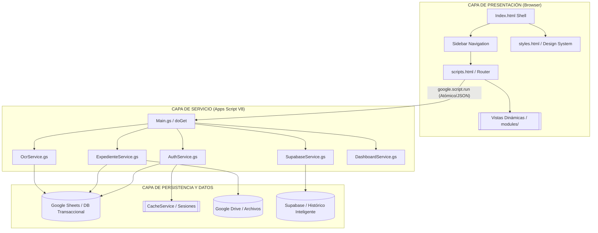
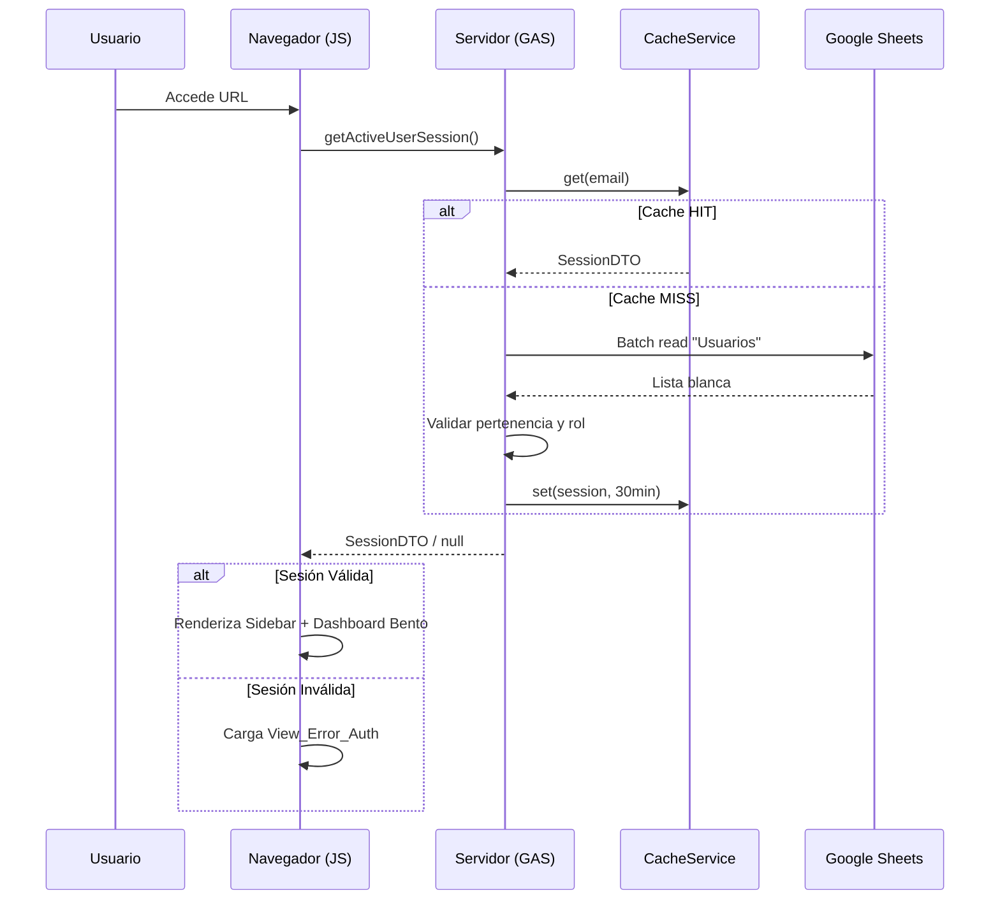
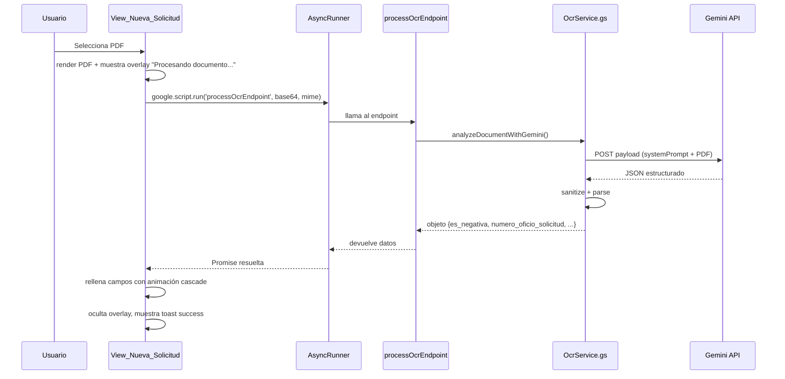

# ◈ Sistema de Compras HCG (Enterprise ERP)

<div align="center">


> **Plataforma ERP Institucional de Nueva Generación** para la gestión integral de compras, requisiciones, expedientes digitales y catálogos del Hospital Civil de Guadalajara. Una arquitectura **Elite SaaS** sobre **Google Apps Script (V8)** con inteligencia artificial y base de datos histórica distribuida.

</div>

---

## 📋 Tabla de Contenidos

- [Descripción del Proyecto](#descripción-del-proyecto)
- [Características Principales](#características-principales)
- [Arquitectura del Sistema](#arquitectura-del-sistema)
- [Inteligencia de Datos (Supabase)](#inteligencia-de-datos-supabase)
- [Flujo de Autenticación](#flujo-de-autenticación)
- [Estructura de Archivos](#estructura-de-archivos)
- [Stack Tecnológico](#stack-tecnológico)
- [Integración Gemini OCR (AI)](#integración-gemini-ocr-ai)
- [UI / UX – Diseño Editorial y Bento‑Grid](#ui-ux‑diseño-editorial-y-bento‑grid)
- [Configuración del Entorno](#configuración-del-entorno)
- [Despliegue y CI/CD](#despliegue-y-cicd)
- [Guía de Estilo del Código](#guía-de-estilo-del-código)
- [Rendimiento y Optimización](#rendimiento-y-optimización)
- [Roadmap](#roadmap)

---

## 📖 Descripción del Proyecto

**Sistema de Compras HCG** ha evolucionado de una herramienta administrativa a una **aplicación ERP monolítica de alto rendimiento** que se ejecuta dentro del ecosistema de Google Workspace. Centraliza y automatiza los flujos de trabajo de adquisición institucional con un enfoque en la integridad transaccional y la experiencia de usuario de élite.

- **Control de acceso** basado en lista blanca almacenada en Google Sheets y cacheada en `CacheService`.
- **Interfaz SPA Pro** con navegación por sidebar vertical y carga dinámica de módulos sin latencia.
- **Design System Premium**: Layout editorial, glassmorphism, bento‑grid para analíticas y tipografía institucional (DM Sans).
- **Módulo de OCR AI**: Extracción inteligente de metadatos mediante **Gemini 3 Flash Lite**, optimizado para documentos oficiales del HCG.
- **Inteligencia Histórica**: Integración con Supabase para consulta en tiempo real de precios de referencia y catálogos históricos.

---

## ✨ Características Principales

| # | Característica | Descripción |
|---|----------------|-------------|
| 1 | 🔐 Autenticación Institucional | Validación contra Google Sheets, caché 30 min, soporte SSO vía Google. |
| 2 | ⚡ SPA con Carga Parcial | Router cliente (`scripts.html`) inyecta módulos dinámicamente. |
| 3 | 🎨 UI Enterprise SaaS | Sidebar vertical, layout editorial, glassmorphism, colores corporativos HCG. |
| 4 | 📦 Arquitectura Modular | Separación estricta entre **Servicios**, **Controladores** y **Vistas**. |
| 5 | 🚀 Optimización Extrema | Lecturas batch (`getValues()`), caché de capa de datos, mínimo overhead de API. |
| 6 | ♿ Accesibilidad Pro | WCAG 2.2, roles ARIA, focus‑visible, contrast ratios optimizados. |
| 7 | 🛡️ Seguridad End‑to‑End | Middleware RPC, protección XSS, serialización JSON atómica para estabilidad. |
| 8 | 🗂️ Split View Engine | Visor PDF interactivo integrado con formulario dinámico de captura. |
| 9 | 🤖 OCR AI (Gemini) | Extracción automática de folios, fechas, negativas y tablas de insumos complejas. |
| 10| 📊 Inteligencia Supabase | Cruce de datos con tabla histórica `Historico` para inteligencia de precios. |
| 11| 🔄 Workflow Flexible | Orquestación de procesos desacoplada de restricciones rígidas de rol para agilidad. |

---

## 🏗️ Arquitectura del Sistema



---

## 📊 Inteligencia de Datos (Supabase)

El sistema integra una capa de inteligencia documental conectada a una base de datos **Supabase**, específicamente diseñada para:
- **Validación de Precios**: Contraste automático de precios unitarios contra la tabla `Historico`.
- **Denominación de Artículos**: Mapeo de códigos internos (`mov_art_codigo`) a descripciones institucionales.
- **Análisis de Proveedores**: Seguimiento histórico de adjudicaciones por división.
- **Consistencia Transaccional**: Asegura que el pipeline de ingesta OCR genere registros alineados con el histórico institucional.

---

## 🔐 Flujo de Autenticación



---

## 📂 Estructura de Archivos

```text
compras-fr/
│   package.json
│   .claspignore
│
└── src/
    │   appsscript.json
    │   Config.gs
    │   Main.gs
    │   Utils.gs
    │
    ├── Services/
    │   ├── AuthService.gs
    │   ├── ExpedienteService.gs
    │   └── OcrService.gs   # <-- nuevo servicio Gemini OCR
    │
    └── ui/
        │   Index.html
        │   scripts.html
        │   styles.html
        │
        └── modules/
            ├── View_Dashboard.html
            ├── View_Solicitudes.html
            ├── View_Expedientes.html
            ├── View_Catalogos.html
            ├── View_Error_Auth.html
            └── View_Nueva_Solicitud.html   # <-- actualizado con stepper y IA
```

---

## 🛠️ Stack Tecnológico

| Componente | Tecnologías |
|------------|------------|
| **Runtime** | Google Apps Script (V8) |
| **Frontend** | HTML5, CSS3 (Flex/Grid), JavaScript (ES2019+) |
| **Diseño** | DM Sans, DM Serif Display, CSS Custom Properties |
| **Persistencia** | Google Sheets (DB), Drive (Blobs) |
| **Optimización** | CacheService, Batch IO |
| **DevOps** | Clasp CLI, Git, VS Code |

---

## 🤖 Integración Gemini OCR (AI)

### Visión General
- **Modelo**: `gemini-3-flash-lite-preview` (el modelo disponible en Google AI Studio).
- **Endpoint**: `https://generativelanguage.googleapis.com/v1beta/models/{MODEL_ID}:generateContent`.
- **Seguridad**: La API‑Key (`GEMINI_API_KEY`) se lee desde `PropertiesService` y nunca se hardcodea.
- **Prompt**: Reglas de auditoría documental (clasificación, folios, negativa, tabla de insumos).
- **Schema**: JSON Schema estricto para garantizar que la respuesta sea parseable.
- **Sanitización**: Eliminación de bloques Markdown (```` ```json ````) y caracteres de control antes del `JSON.parse`.

### Flujo de Datos


### Manejo de Errores
- **Clave faltante** → `console.warn` en `Config.gs` y fallback sin OCR.
- **Respuesta vacía o JSON inválido** → excepción con mensaje descriptivo, overlay muestra error y permite entrada manual.
- **Timeout / cuota** → se captura y se muestra toast de fallback.

---

## 🎨 UI / UX – Stepper de Procesamiento

El overlay de procesamiento ahora usa un **Progress Ring** y un **Micro‑Stepper vertical** con animaciones de spinner y check‑mark. Cada paso avanza automáticamente (≈2‑4 s) y se sincroniza con la respuesta real del servidor. Los campos del formulario se rellenan con una **animación cascade** (`field-filled`) que destaca visualmente los datos autogenerados.

### Componentes clave
- `process-steps` → lista de pasos (Leyendo documento, Identificando campos, Extrayendo datos, Validando información).
- `process-ring` → anillo SVG con porcentaje en tiempo real.
- `field-filled` → animación que ilumina el input autocompletado.
- `Toast.show()` → notificaciones breves para éxito o fallo.

---

## ⚙️ Configuración del Entorno

| Herramienta | Versión mínima |
|------------|----------------|
| Node.js | ≥ 16.x |
| clasp | ≥ 2.x |
| Git | ≥ 2.x |

### Pasos de Instalación
```bash
git clone https://github.com/jlangarica/compras-fr.git
cd compras-fr
npm install
clasp login
clasp clone "TU_SCRIPT_ID"
```

#### Propiedades del script (clave API)
1. Abre el proyecto en el editor de Apps Script.
2. **⚙️ Configuración → Propiedades del script**.
3. Añade la clave:
   - **Clave**: `GEMINI_API_KEY`
   - **Valor**: `<tu‑token‑de‑Google‑AI‑Studio>`
4. Guarda.

---

## 🚀 Despliegue y CI/CD

```bash
# Cada push a main
npm run lint      # lint con eslint (solo para .gs vía eslint‑plugin‑gas)
npm run test      # pruebas unitarias con clasp‑test (mock de Services)
clasp push        # despliegue a Google Apps Script
```

Los **triggers** (`doGet`, `onOpen`) están definidos en `appsscript.json`.  El proceso de despliegue mantiene versiones sin perder historial.

---

## 📚 Guía de Estilo del Código

### Backend (GAS)
- **Nomenclatura**: `UPPER_SNAKE_CASE` para constantes, `camelCase` para funciones/variables, `PascalCase` para clases.
- **JSDoc** obligatorio en todas las funciones públicas.
- **Batching** obligatorio: nunca usar `getValue/setValue` dentro de loops.
- **LockService** para operaciones críticas (generación atómica de folios).

### Frontend (HTML/CSS/JS)
- **BEM Lite** para clases (`.card`, `.step-item`, `.field-filled`).
- **Custom Properties** (`--color-primary`, `--spacing-lg`).
- **Sin CSS/JS externos locales**; se incluyen vía CDN cuando sea necesario.
- **Eventos**: usar `google.script.run` con `.withSuccessHandler()` y `.withFailureHandler()`.

---

## 📈 Rendimiento y Optimización

| Técnica | Implementación | Ganancia estimada |
|---------|----------------|-------------------|
| Cache de Sesión | `CacheService` (TTL 30 min) | -98 % latencia auth |
| SPA Router | Inyección DOM sin recarga | Navegación instantánea |
| Batch IO | `getValues()` → procesar en memoria | Reducción cuota API 80 % |
| Passive Listeners | `{ passive: true }` en scroll/drag | Suavidad en móviles |
| Asset Preconnect | `<link rel="preconnect" href="https://fonts.googleapis.com">` | +120 ms carga fuentes |

---

## 🗺️ Roadmap

- **v1.3.0** – Vertical Stepper completo, validación de tabla de insumos, integración con FSM.
- **v2.0.0** – Reportes automáticos, tablero de control gerencial avanzado, soporte multilingüe.
- **v2.1.0** – Migración a Gemini 3 Flash (versión estable) y pruebas A/B de UI.

---

<div align="center">

**◈ Sistema de Compras HCG** · Hospital Civil de Guadalajara
*División de Servicios Administrativos*

</div>
