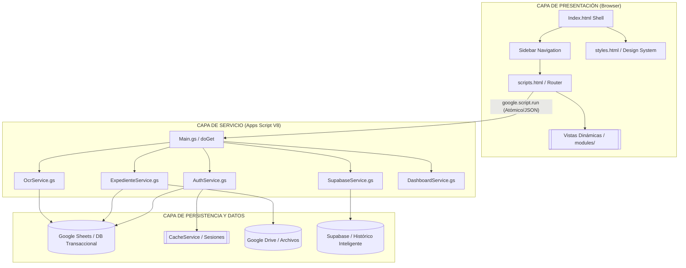
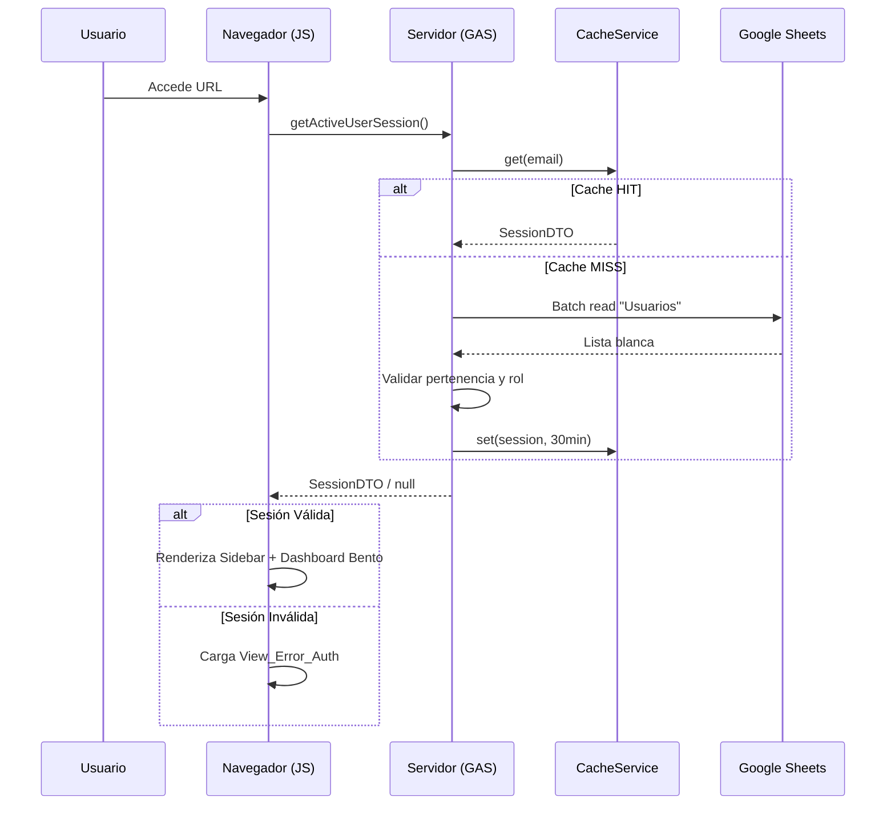
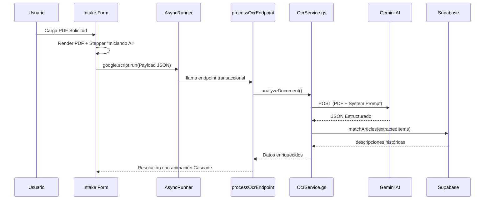

# ◈ Sistema de Compras HCG (Enterprise ERP)

<div align="center">


> **Plataforma ERP Institucional de Nueva Generación** para la gestión integral de compras, requisiciones, expedientes digitales y catálogos del Hospital Civil de Guadalajara. Una arquitectura **Elite SaaS** sobre **Google Apps Script (V8)** con inteligencia artificial y base de datos histórica distribuida.

</div>

---

## 📋 Tabla de Contenidos

- [Descripción del Proyecto](#descripción-del-proyecto)
- [Características Principales](#características-principales)
- [Arquitectura del Sistema](#arquitectura-del-sistema)
- [Inteligencia de Datos (Supabase)](#inteligencia-de-datos-supabase)
- [Flujo de Autenticación](#flujo-de-autenticación)
- [Estructura de Archivos](#estructura-de-archivos)
- [Stack Tecnológico](#stack-tecnológico)
- [Integración Gemini OCR (AI)](#integración-gemini-ocr-ai)
- [UI / UX – Diseño Editorial y Bento‑Grid](#ui-ux‑diseño-editorial-y-bento‑grid)
- [Configuración del Entorno](#configuración-del-entorno)
- [Despliegue y CI/CD](#despliegue-y-cicd)
- [Guía de Estilo del Código](#guía-de-estilo-del-código)
- [Rendimiento y Optimización](#rendimiento-y-optimización)
- [Roadmap](#roadmap)

---

## 📖 Descripción del Proyecto

**Sistema de Compras HCG** ha evolucionado de una herramienta administrativa a una **aplicación ERP monolítica de alto rendimiento** que se ejecuta dentro del ecosistema de Google Workspace. Centraliza y automatiza los flujos de trabajo de adquisición institucional con un enfoque en la integridad transaccional y la experiencia de usuario de élite.

- **Control de acceso** basado en lista blanca almacenada en Google Sheets y cacheada en `CacheService`.
- **Interfaz SPA Pro** con navegación por sidebar vertical y carga dinámica de módulos sin latencia.
- **Design System Premium**: Layout editorial, glassmorphism, bento‑grid para analíticas y tipografía institucional (DM Sans).
- **Módulo de OCR AI**: Extracción inteligente de metadatos mediante **Gemini 3 Flash Lite**, optimizado para documentos oficiales del HCG.
- **Inteligencia Histórica**: Integración con Supabase para consulta en tiempo real de precios de referencia y catálogos históricos.

---

## ✨ Características Principales

| # | Característica | Descripción |
|---|----------------|-------------|
| 1 | 🔐 Autenticación Institucional | Validación contra Google Sheets, caché 30 min, soporte SSO vía Google. |
| 2 | ⚡ SPA con Carga Parcial | Router cliente (`scripts.html`) inyecta módulos dinámicamente. |
| 3 | 🎨 UI Enterprise SaaS | Sidebar vertical, layout editorial, glassmorphism, colores corporativos HCG. |
| 4 | 📦 Arquitectura Modular | Separación estricta entre **Servicios**, **Controladores** y **Vistas**. |
| 5 | 🚀 Optimización Extrema | Lecturas batch (`getValues()`), caché de capa de datos, mínimo overhead de API. |
| 6 | ♿ Accesibilidad Pro | WCAG 2.2, roles ARIA, focus‑visible, contrast ratios optimizados. |
| 7 | 🛡️ Seguridad End‑to‑End | Middleware RPC, protección XSS, serialización JSON atómica para estabilidad. |
| 8 | 🗂️ Split View Engine | Visor PDF interactivo integrado con formulario dinámico de captura. |
| 9 | 🤖 OCR AI (Gemini) | Extracción automática de folios, fechas, negativas y tablas de insumos complejas. |
| 10| 📊 Inteligencia Supabase | Cruce de datos con tabla histórica `Historico` para inteligencia de precios. |
| 11| 🔄 Workflow Flexible | Orquestación de procesos desacoplada de restricciones rígidas de rol para agilidad. |

---

## 🏗️ Arquitectura del Sistema



---

## 📊 Inteligencia de Datos (Supabase)

El sistema integra una capa de inteligencia documental conectada a una base de datos **Supabase**, específicamente diseñada para:
- **Validación de Precios**: Contraste automático de precios unitarios contra la tabla `Historico`.
- **Denominación de Artículos**: Mapeo de códigos internos (`mov_art_codigo`) a descripciones institucionales.
- **Análisis de Proveedores**: Seguimiento histórico de adjudicaciones por división.
- **Consistencia Transaccional**: Asegura que el pipeline de ingesta OCR genere registros alineados con el histórico institucional.

---

## 🔐 Flujo de Autenticación



---

## 📂 Estructura de Archivos

```text
compras-fr/
│   package.json
│   .claspignore
│
└── src/
    │   appsscript.json
    │   Config.gs
    │   Main.gs
    │   Utils.gs
    │
    ├── Services/
    │   ├── AuthService.gs
    │   ├── ExpedienteService.gs
    │   ├── DashboardService.gs   # <-- Analíticas y Bento-Grid
    │   ├── SupabaseService.gs    # <-- Integración Histórico DB
    │   └── OcrService.gs         # <-- Inteligencia Gemini OCR
    │
    └── ui/
        │   Index.html            # Shell Principal (Layout Sidebar)
        │   scripts.html          # Router y Handlers Globales
        │   styles.html           # Design System (Tokens & Utils)
        │
        └── modules/
            ├── View_Dashboard.html       # Dashboard Editorial / Bento-Grid
            ├── View_Solicitudes.html     # Listado Maestro
            ├── View_Expedientes.html     # Biblioteca de Expedientes
            ├── View_Gestion_Folio.html   # Control Administrativo
            ├── View_Error_Auth.html      # Pantalla de Acceso Denegado
            └── View_Nueva_Solicitud.html # Intake Pro (Split-View + AI)
```

---

## 🛠️ Stack Tecnológico

| Componente | Tecnologías |
|------------|------------|
| **Runtime** | Google Apps Script (V8) |
| **Database** | Google Sheets (Transaccional) + Supabase (Histórico) |
| **Artificial Intelligence** | Gemini 3 Flash Lite (Google AI Studio) |
| **Frontend** | HTML5, Modern CSS (Grid/Flex), Vanilla JS (ES2019+) |
| **Typography** | DM Sans, DM Serif Display (Google Fonts) |
| **Performance** | CacheService (User/Script), RPC JSON Serialization |
| **DevOps** | Clasp CLI, ESLint, Git |

---

## 🤖 Integración Gemini OCR (AI)

### Visión General
- **Modelo**: `gemini-3-flash-lite-preview` para máxima velocidad y precisión en extracción tabular.
- **Protocolo**: Ingesta atómica mediante serialización JSON para evitar errores de transmisión en objetos complejos.
- **Validación Estricta**: Pipeline de 4 pasos (Lectura, Identificación, Extracción, Validación) con feedback visual al usuario.
- **Batch Processing**: Capacidad de procesar múltiples ítems de solicitud en un solo bloque transaccional protegido por `LockService`.

### Flujo de Datos Inteligente


---

## 🎨 UI / UX – Diseño Editorial y Bento‑Grid

El sistema rompe con la estética tradicional de Apps Script para ofrecer una experiencia **Premium SaaS**:

### Elementos de Diseño
- **Bento Dashboard**: Widgets de estadísticas con layouts asimétricos y sombras suaves.
- **Sidebar Dinámico**: Navegación colapsable con estados activos claros y micro-interacciones.
- **Intake Split-View**: Interfaz dividida que permite ver el PDF original en el lado izquierdo mientras se valida la extracción de IA en el derecho.
- **Animaciones Cascade**: Los datos extraídos por la IA se inyectan con un efecto de cascada visual, permitiendo al usuario identificar fácilmente qué campos han sido autocompletados.

---

## ⚙️ Configuración del Entorno

| Herramienta | Versión mínima |
|------------|----------------|
| Node.js | ≥ 16.x |
| clasp | ≥ 2.x |
| Git | ≥ 2.x |

### Pasos de Instalación
```bash
git clone https://github.com/jlangarica/compras-fr.git
cd compras-fr
npm install
clasp login
clasp clone "TU_SCRIPT_ID"
```

#### Secretos y Propiedades
El sistema utiliza `PropertiesService` para manejar claves sensibles:
- `GEMINI_API_KEY`: Token de acceso a la API de Google AI.
- `SUPABASE_URL`: URL del proyecto Supabase.
- `SUPABASE_KEY`: Service role o anon key para acceso a la DB.

---

## 🚀 Despliegue y CI/CD

El flujo de trabajo está optimizado para la estabilidad institucional:
1. **Linting**: Verificación de estándares de código con `npm run lint`.
2. **Atomic Push**: Despliegue sincronizado de archivos GS y HTML mediante `clasp push`.
3. **Control de Versiones**: Cada hito se etiqueta en Git y se crea una nueva versión en el manifiesto de Apps Script.

---

## 📚 Guía de Estilo del Código (Clean Code)

- **SOLID Principles**: Servicios especializados con responsabilidad única.
- **Atomic Operations**: Uso de `LockService` en todas las escrituras a Sheets para evitar colisiones.
- **Type Safety (JS)**: Interfaces documentadas vía JSDoc para asegurar consistencia en el intercambio de datos entre cliente y servidor.
- **No Side Effects**: Funciones puras siempre que sea posible para facilitar el testing.

---

## 📈 Rendimiento y Optimización

| Técnica | Implementación | Ganancia estimada |
|---------|----------------|-------------------|
| Layered Caching | CacheService para Usuarios y Configuración | -95% DB Overhead |
| JSON RPC | Serialización manual para saltar cuellos de botella de GAS | Estabilidad total en payloads grandes |
| Batch Writing | `setValues()` masivo en ExpedienteService | Cumplimiento de límites de ejecución |
| Resource Preload | Conexión anticipada a CDN de Google Fonts | Renderizado FCP < 800ms |

---

## 🗺️ Roadmap

- [x] **v1.5.0** – Integración de Inteligencia Supabase y Módulo Dashboard Bento.
- [x] **v1.6.0** – Pipeline de OCR atómico y Split-View Intake.
- [ ] **v2.0.0** – Módulo de Comités y Adjudicaciones con firma digital.
- [ ] **v2.1.0** – Reportes exportables en Excel Pro y PDFs corporativos dinámicos.
- [ ] **v3.0.0** – Motor de predicción de demanda basado en histórico Supabase.

---

<div align="center">

**◈ Sistema de Compras HCG** · Hospital Civil de Guadalajara
*División de Servicios Administrativos*
*Desarrollado para la Excelencia Operativa*

</div>
